### Lesson 9 Logistic regression
### Lesson 9.2 
### Data
Load package

```r
library("boot")
data("urine")
?urine
head(urine)
```

```
##   r gravity   ph osmo cond urea calc
## 1 0   1.021 4.91  725   NA  443 2.45
## 2 0   1.017 5.74  577 20.0  296 4.49
## 3 0   1.008 7.20  321 14.9  101 2.36
## 4 0   1.011 5.51  408 12.6  224 2.15
## 5 0   1.005 6.52  187  7.5   91 1.16
## 6 0   1.020 5.27  668 25.3  252 3.34
```
Before we conduct analysis, let's remove those missing values.

```r
dat = na.omit(urine)
dim(dat)
```

```
## [1] 77  7
```
Let's look at a pairs scatterplot for each of the seven variables.

```r
pairs(dat)
```

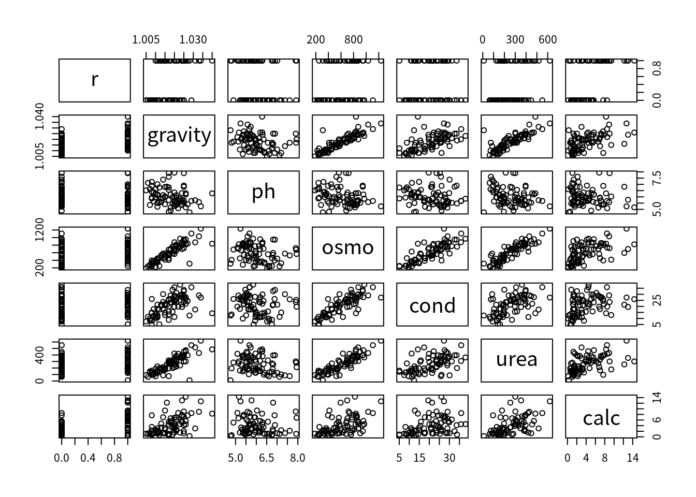
One thing that stands out is that several of theses variables are strongly correlated with one another. For example, `osmo` and `gravity` appear to have a very close linear relationship. Collinearity between $x$ variables in linear regression models can cause truoube for statistical inference.

Two correlated variables will compete for the ability to predict the response variable, leading to unstable estimates.
This is not a problem for prediction of the response, if prediction is the end goal of the model. But if our objective is to discover how the variables relate to the response, we should avoid collinearity.
We can more formally estimate the correlation among these variables using the `corrplot` package.

```r
library("corrplot")
```

```
## corrplot 0.89 loaded
```

```r
Cor = cor(dat)
corrplot(Cor, type="upper", method="ellipse", tl.pos="d")
corrplot(Cor, type="lower", method="number", col="black", add=TRUE, diag=FALSE, tl.pos="n", cl.pos="n")
```

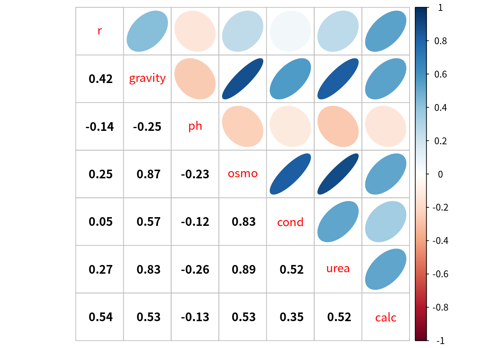

```r
X = scale(dat[,-1], center=TRUE, scale=TRUE)
head(X[,"gravity"])
```

```
##          2          3          4          5          6          7 
## -0.1403037 -1.3710690 -0.9608139 -1.7813240  0.2699514 -0.8240622
```

```r
colMeans(X)
```

```
##       gravity            ph          osmo          cond          urea 
## -9.861143e-15  8.511409e-17  1.515743e-16 -1.829852e-16  7.335402e-17 
##          calc 
## -1.689666e-18
```

#### variable selection
One primary goal of this analysis is to find out which variables are related to the presence of calcium oxalate crystals. This objective is often called “variable selection.” We have already seen one way to do this: fit several models that include different sets of variables and see which one has the best DIC. Another way to do this is to use a linear model where the priors for the $β$ coefficients favor values near 0 (indicating a weak relationship). This way, the burden of establishing association lies with the data. If there is not a strong signal, we assume it doesn’t exist.

Rather than tailoring a prior for each individual $β$ based on the scale its covariate takes values on, it is customary to subtract the mean and divide by the standard deviation for each variable.


```r
X = scale(dat[,-1], center=TRUE, scale=TRUE)
head(X[,"gravity"])
```

```
##          2          3          4          5          6          7 
## -0.1403037 -1.3710690 -0.9608139 -1.7813240  0.2699514 -0.8240622
```

```r
colMeans(X)
```

```
##       gravity            ph          osmo          cond          urea 
## -9.861143e-15  8.511409e-17  1.515743e-16 -1.829852e-16  7.335402e-17 
##          calc 
## -1.689666e-18
```

We can see that the values for these $x$ variables have changed, so that the column means for $x$ are all close to zeros.

We can also calculate the column's standard deviations using the  `apply` function. Apply, where we want to apply this function, standard deviation to the columns which is the second index of the dimension of $x$. 
The rows are index 1 and the columns are index 2.

```r
apply(X, 2, sd)
```

```
## gravity      ph    osmo    cond    urea    calc 
##       1       1       1       1       1       1
```
### Model
Our prior for the $β$ (which we’ll call b in the model) coefficients will be the double exponential (or Laplace) distribution, which as the name implies, is the exponential distribution with tails extending in the positive direction as well as the negative direction, with a sharp peak at 0. We can read more about it in the `JAGS` manual. The distribution looks like:

```r
ddexp = function(x, mu, tau) {
  0.5*tau*exp(-tau*abs(x-mu)) 
}
curve(ddexp(x, mu=0.0, tau=1.0), from=-5.0, to=5.0, ylab="density", main="Double exponential\ndistribution") # double exponential distribution
curve(dnorm(x, mean=0.0, sd=1.0), from=-5.0, to=5.0, lty=2, add=TRUE) # normal distribution
legend("topright", legend=c("double exponential", "normal"), lty=c(1,2), bty="n")
```

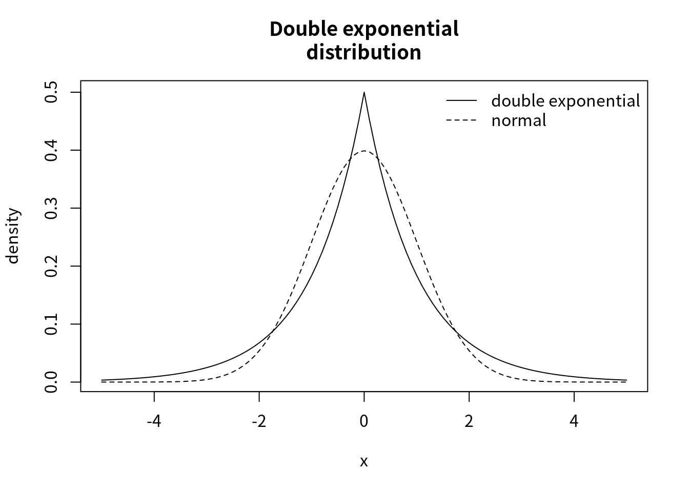

```r
library("rjags")
```

```
## Loading required package: coda
```

```
## Linked to JAGS 4.3.0
```

```
## Loaded modules: basemod,bugs
```


```r
mod1_string = " model {
    for (i in 1:length(y)) {
        y[i] ~ dbern(p[i])
        logit(p[i]) = int + b[1]*gravity[i] + b[2]*ph[i] + b[3]*osmo[i] + b[4]*cond[i] + b[5]*urea[i] + b[6]*calc[i]
    }
    int ~ dnorm(0.0, 1.0/25.0)
    for (j in 1:6) {
        b[j] ~ ddexp(0.0, sqrt(2.0)) # has variance 1.0
    }
} "

set.seed(92)
head(X)
```

```
##      gravity         ph       osmo       cond        urea        calc
## 2 -0.1403037 -0.4163725 -0.1528785 -0.1130908  0.25747827  0.09997564
## 3 -1.3710690  1.6055972 -1.2218894 -0.7502609 -1.23693077 -0.54608444
## 4 -0.9608139 -0.7349020 -0.8585927 -1.0376121 -0.29430353 -0.60978050
## 5 -1.7813240  0.6638579 -1.7814497 -1.6747822 -1.31356713 -0.91006194
## 6  0.2699514 -1.0672806  0.2271214  0.5490664 -0.07972172 -0.24883614
## 7 -0.8240622 -0.5825618 -0.6372741 -0.4379226 -0.51654898 -0.83726644
```

```r
data_jags = list(y=dat$r, gravity=X[,"gravity"], ph=X[,"ph"], osmo=X[,"osmo"], cond=X[,"cond"], urea=X[,"urea"], calc=X[,"calc"])

params = c("int", "b")

mod1 = jags.model(textConnection(mod1_string), data=data_jags, n.chains=3)
```

```
## Compiling model graph
##    Resolving undeclared variables
##    Allocating nodes
## Graph information:
##    Observed stochastic nodes: 77
##    Unobserved stochastic nodes: 7
##    Total graph size: 1085
## 
## Initializing model
```

```r
update(mod1, 1e3)

mod1_sim = coda.samples(model=mod1,
                        variable.names=params,
                        n.iter=5e3)
mod1_csim = as.mcmc(do.call(rbind, mod1_sim))

## convergence diagnostics
plot(mod1_sim, ask=TRUE)
```

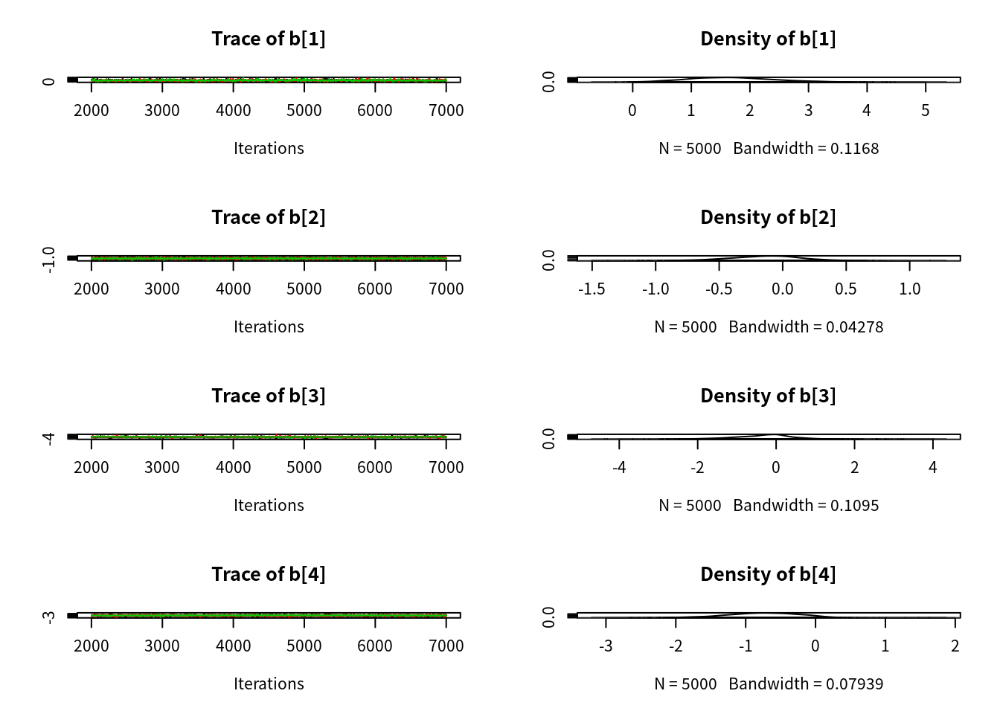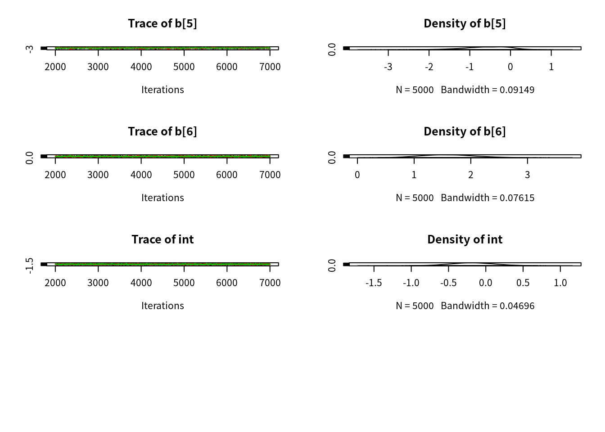

```r
gelman.diag(mod1_sim)
```

```
## Potential scale reduction factors:
## 
##      Point est. Upper C.I.
## b[1]       1.00       1.00
## b[2]       1.00       1.00
## b[3]       1.01       1.02
## b[4]       1.01       1.02
## b[5]       1.00       1.01
## b[6]       1.00       1.01
## int        1.00       1.00
## 
## Multivariate psrf
## 
## 1.01
```

```r
autocorr.diag(mod1_sim)
```

```
##               b[1]          b[2]       b[3]       b[4]        b[5]         b[6]
## Lag 0  1.000000000  1.0000000000 1.00000000 1.00000000 1.000000000  1.000000000
## Lag 1  0.834057455  0.2959526407 0.89523954 0.76061370 0.789902677  0.479953708
## Lag 5  0.420339772  0.0175656487 0.57515096 0.34216393 0.379953243  0.033461769
## Lag 10 0.185123504  0.0008161653 0.34056704 0.16762220 0.147504416  0.022151175
## Lag 50 0.001571776 -0.0106822333 0.04847578 0.03095607 0.006426726 -0.003593543
##                 int
## Lag 0   1.000000000
## Lag 1   0.280515340
## Lag 5   0.034381541
## Lag 10  0.001915694
## Lag 50 -0.003827513
```

```r
autocorr.plot(mod1_sim)
```

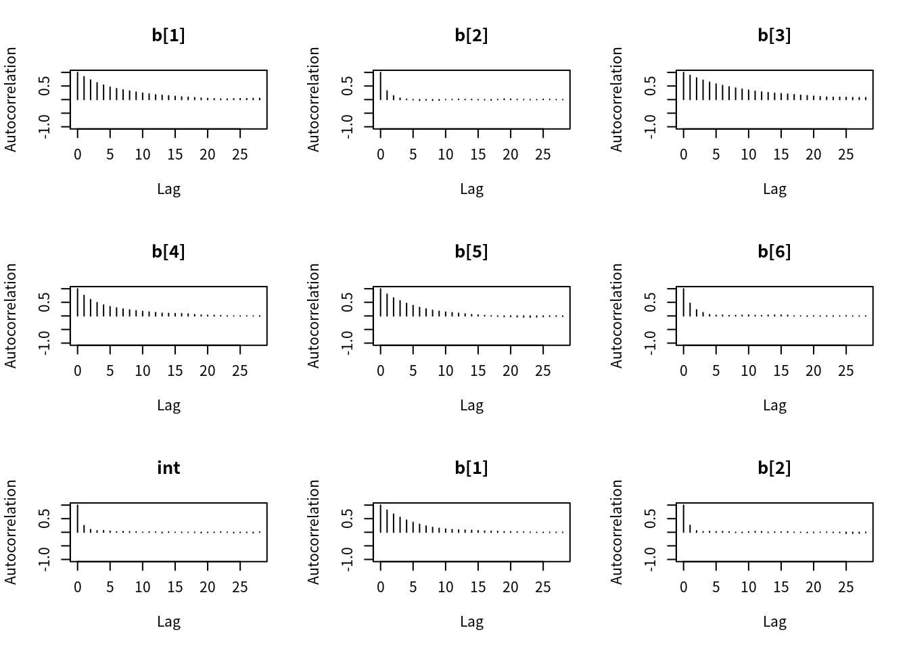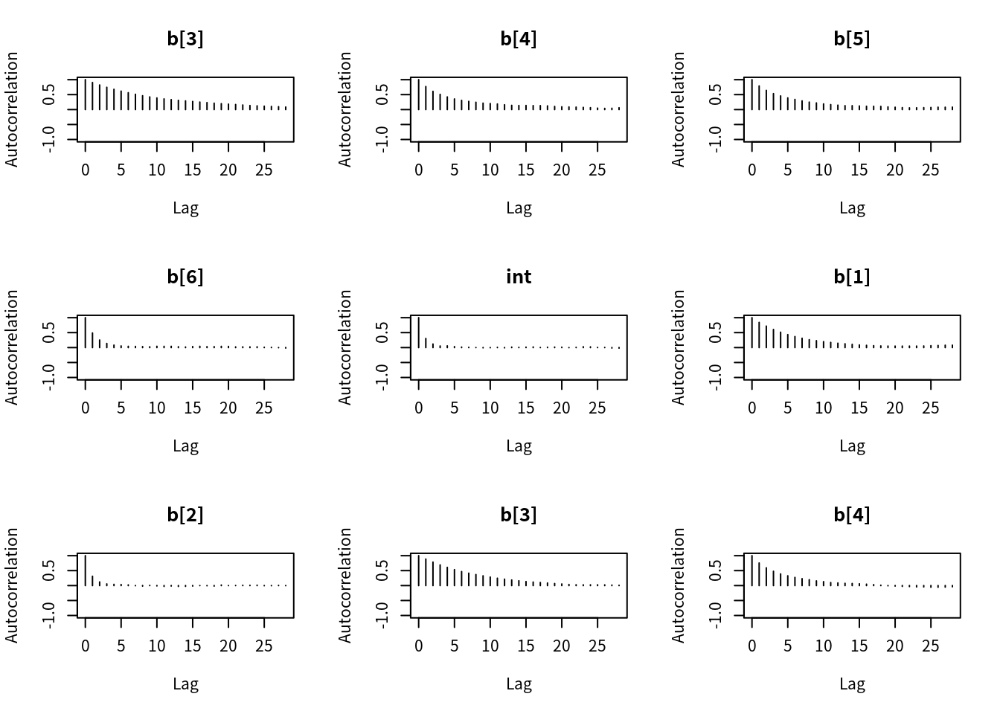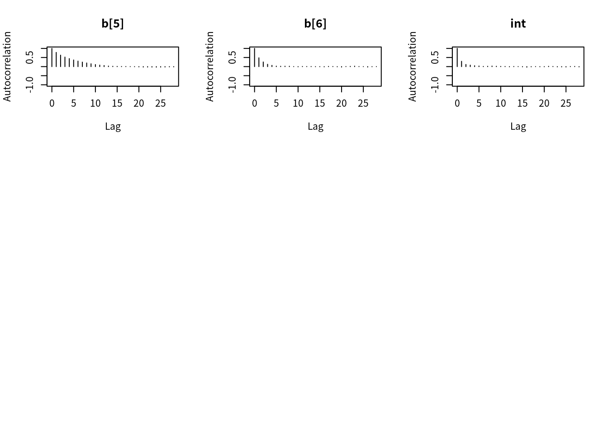

```r
effectiveSize(mod1_sim)
```

```
##      b[1]      b[2]      b[3]      b[4]      b[5]      b[6]       int 
## 1324.8594 7814.3556  829.2246 1426.5544 1433.5891 5177.4757 7095.7138
```

```r
## calculate DIC
(dic1 = dic.samples(mod1, n.iter=1e3))
```

```
## Mean deviance:  68.65 
## penalty 5.606 
## Penalized deviance: 74.26
```


```r
summary(mod1_sim)
```

```
## 
## Iterations = 2001:7000
## Thinning interval = 1 
## Number of chains = 3 
## Sample size per chain = 5000 
## 
## 1. Empirical mean and standard deviation for each variable,
##    plus standard error of the mean:
## 
##         Mean     SD Naive SE Time-series SE
## b[1]  1.6956 0.7538 0.006155       0.020863
## b[2] -0.1431 0.2877 0.002349       0.003272
## b[3] -0.3310 0.8154 0.006658       0.028430
## b[4] -0.7511 0.5124 0.004184       0.013793
## b[5] -0.6079 0.5906 0.004822       0.015612
## b[6]  1.6138 0.4916 0.004014       0.006838
## int  -0.1781 0.3031 0.002475       0.003601
## 
## 2. Quantiles for each variable:
## 
##         2.5%     25%     50%      75%  97.5%
## b[1]  0.3599  1.1616  1.6465  2.17373 3.2941
## b[2] -0.7529 -0.3235 -0.1270  0.04652 0.4012
## b[3] -2.1196 -0.8033 -0.2501  0.14426 1.2476
## b[4] -1.8258 -1.0845 -0.7308 -0.38533 0.1466
## b[5] -1.9223 -0.9709 -0.5556 -0.17840 0.3673
## b[6]  0.7306  1.2676  1.5893  1.93265 2.6464
## int  -0.7608 -0.3842 -0.1814  0.02535 0.4238
```


```r
par(mfrow=c(3,2))
densplot(mod1_csim[,1:6], xlim=c(-3.0, 3.0))
```

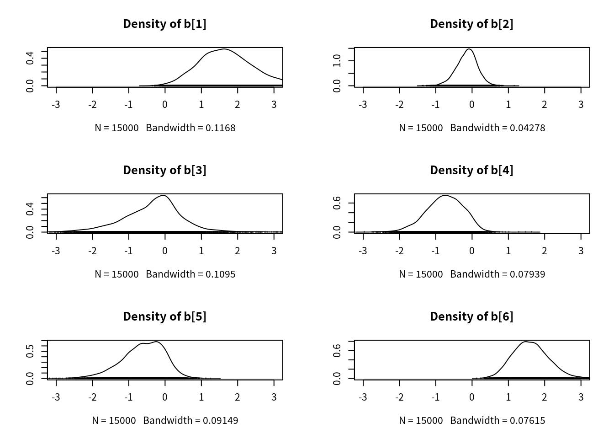


```r
colnames(X) # variable names
```

```
## [1] "gravity" "ph"      "osmo"    "cond"    "urea"    "calc"
```
It is clear that the coefficients for variables `gravity`, `cond` (conductivity), and `calc` (calcium concentration) are not 0. The posterior distribution for the coefficient of `osmo` (osmolarity) looks like the prior, and is almost centered on 0 still, so we’ll conclude that `osmo` is not a strong predictor of calcium oxalate crystals. The same goes for `ph`.

`urea` (urea concentration) appears to be a borderline case. However, if we refer back to our correlations among the variables, we see that `urea` is highly correlated with `gravity`, so we opt to remove it.

Our second model looks like this:

```r
mod2_string = " model {
    for (i in 1:length(y)) {
        y[i] ~ dbern(p[i])
        logit(p[i]) = int + b[1]*gravity[i] + b[2]*cond[i] + b[3]*calc[i]
    }
    int ~ dnorm(0.0, 1.0/25.0)
    for (j in 1:3) {
        b[j] ~ dnorm(0.0, 1.0/25.0) # noninformative for logistic regression
    }
} "

mod2 = jags.model(textConnection(mod2_string), data=data_jags, n.chains=3)
```

```
## Warning in jags.model(textConnection(mod2_string), data = data_jags, n.chains =
## 3): Unused variable "ph" in data
```

```
## Warning in jags.model(textConnection(mod2_string), data = data_jags, n.chains =
## 3): Unused variable "osmo" in data
```

```
## Warning in jags.model(textConnection(mod2_string), data = data_jags, n.chains =
## 3): Unused variable "urea" in data
```

```
## Compiling model graph
##    Resolving undeclared variables
##    Allocating nodes
## Graph information:
##    Observed stochastic nodes: 77
##    Unobserved stochastic nodes: 4
##    Total graph size: 635
## 
## Initializing model
```

```r
update(mod2, 1e3)

mod2_sim = coda.samples(model=mod2,
                        variable.names=params,
                        n.iter=5e3)
mod2_csim = as.mcmc(do.call(rbind, mod2_sim))

plot(mod2_sim, ask=TRUE)
```

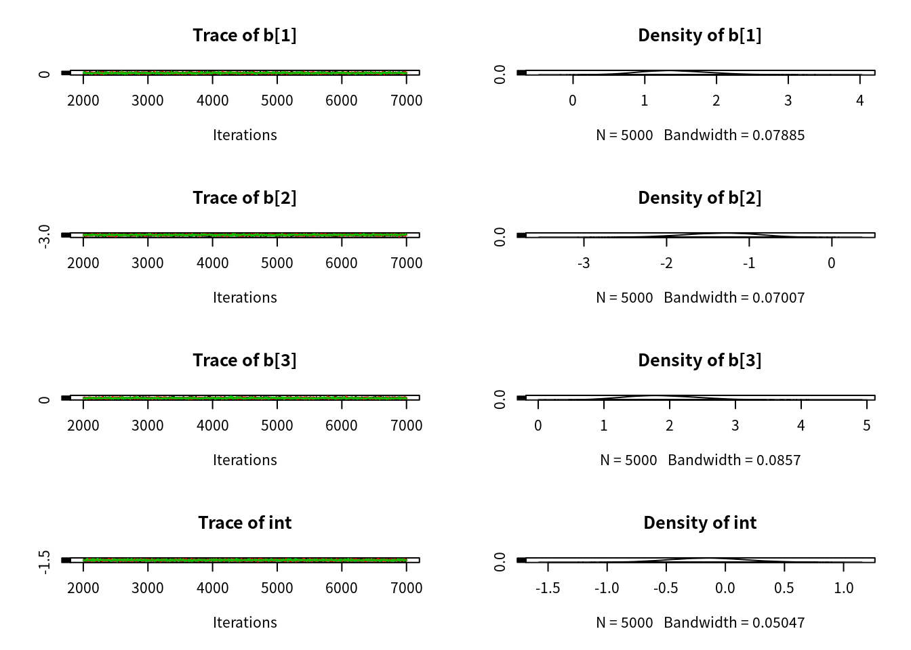

```r
gelman.diag(mod2_sim)
```

```
## Potential scale reduction factors:
## 
##      Point est. Upper C.I.
## b[1]          1       1.01
## b[2]          1       1.01
## b[3]          1       1.01
## int           1       1.00
## 
## Multivariate psrf
## 
## 1
```

```r
autocorr.diag(mod2_sim)
```

```
##               b[1]          b[2]         b[3]          int
## Lag 0  1.000000000  1.0000000000  1.000000000  1.000000000
## Lag 1  0.588370437  0.6672117624  0.500890557  0.283966101
## Lag 5  0.114832338  0.1587722955  0.036115389 -0.001447891
## Lag 10 0.018844203  0.0360317753 -0.002364612 -0.006944554
## Lag 50 0.006456237 -0.0003808793  0.014200934 -0.001769992
```

```r
autocorr.plot(mod2_sim)
```

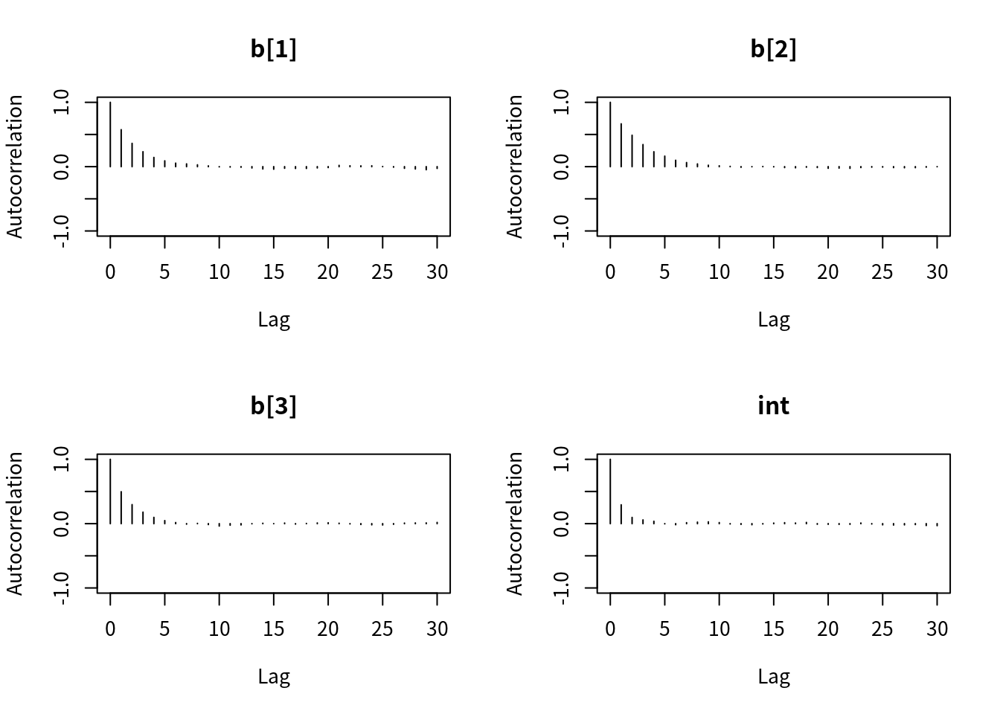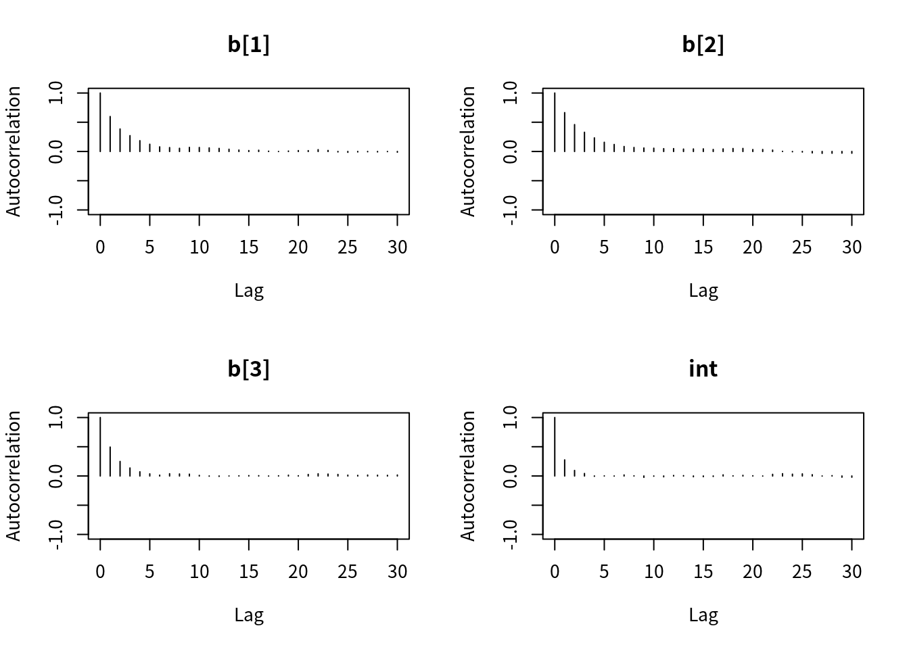

```r
effectiveSize(mod2_sim)
```

```
##     b[1]     b[2]     b[3]      int 
## 3230.709 2658.598 4581.956 8151.802
```

```r
dic2 = dic.samples(mod2, n.iter=1e3)
```

### Results

```r
dic1
```

```
## Mean deviance:  68.65 
## penalty 5.606 
## Penalized deviance: 74.26
```

```r
dic2
```

```
## Mean deviance:  71.14 
## penalty 3.982 
## Penalized deviance: 75.12
```

```r
summary(mod2_sim)
```

```
## 
## Iterations = 2001:7000
## Thinning interval = 1 
## Number of chains = 3 
## Sample size per chain = 5000 
## 
## 1. Empirical mean and standard deviation for each variable,
##    plus standard error of the mean:
## 
##         Mean     SD Naive SE Time-series SE
## b[1]  1.4274 0.5092 0.004158       0.009013
## b[2] -1.3600 0.4523 0.003693       0.008770
## b[3]  1.8851 0.5532 0.004517       0.008199
## int  -0.1505 0.3258 0.002660       0.003617
## 
## 2. Quantiles for each variable:
## 
##         2.5%     25%    50%      75%   97.5%
## b[1]  0.4942  1.0725  1.394  1.75454  2.5096
## b[2] -2.3002 -1.6540 -1.337 -1.04185 -0.5313
## b[3]  0.9023  1.4952  1.851  2.24360  3.0455
## int  -0.7826 -0.3705 -0.152  0.06708  0.4988
```

```r
HPDinterval(mod2_csim)
```

```
##           lower      upper
## b[1]  0.4291388  2.4241326
## b[2] -2.2557100 -0.5020373
## b[3]  0.8394454  2.9513298
## int  -0.7617474  0.5136500
## attr(,"Probability")
## [1] 0.95
```

```r
par(mfrow=c(3,1))
densplot(mod2_csim[,1:3], xlim=c(-3.0, 3.0))
```

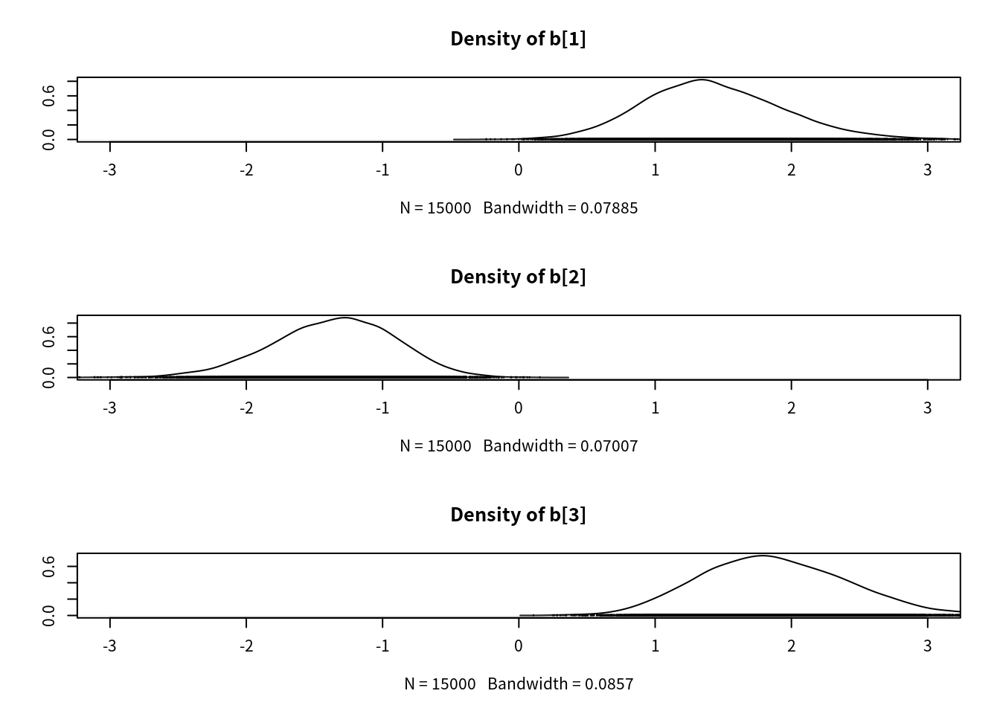

```r
colnames(X)[c(1,4,6)] # variable names
```

```
## [1] "gravity" "cond"    "calc"
```

The DIC is actually better for the first model. Note that we did change the prior between models, and generally we should not use the DIC to choose between priors. Hence comparing DIC between these two models may not be a fair comparison. Nevertheless, they both yield essentially the same conclusions. Higher values of `gravity` and `calc` (calcium concentration) are associated with higher probabilities of calcium oxalate crystals, while higher values of `cond` (conductivity) are associated with lower probabilities of calcium oxalate crystals.

There are more modeling options in this scenario, perhaps including transformations of variables, different priors, and interactions between the predictors, but we’ll leave it to you to see if you can improve the model.

### Lesson 9.3
### Prediction from a logisic regression model
How do we turn model parameter estimates into model predictions? The key is the form of the model. Remember that the likelihood is Bernoulli, which is 1 with probability p. We modeled the logit of $p$ as a linear model, which we showed in the first segment of this lesson leads to an exponential form for $E(y)=p$.


```r
(pm_coef = colMeans(mod2_csim))
```

```
##       b[1]       b[2]       b[3]        int 
##  1.4273834 -1.3599920  1.8850556 -0.1504681
```
The posterior mean of the intercept was about −0.15. Since we centered and scaled all of the covariates, values of 0 for each x correspond to the average values. Therefore, if we use our last model, then our point estimate for the probability of calcium oxalate crystals when `gravity`, `cond`, and `calc` are at their average values is $1/(1+e^{-(-0.15)})=0.4625702$.

Now suppose we want to make a prediction for a new specimen whose value of `gravity` is average, whose value of `cond` is one standard deviation below the mean, and whose value of `calc` is one standard deviation above the mean. Our point estimate for the probability of calcium oxalate crystals is $1/(1+e^{−(−0.15+1.4∗0.0−1.3∗(−1.0)+1.9∗(1.0))})= 0.9547825$.

If we want to make predictions in terms of the original $x$ variable values, we have two options:

  1. For each $x$ variable, subtract the mean and divide by the standard deviation for that variable in the original data set used to fit the model.
  
  2. Re-fit the model without centering and scaling the covariates.

### Predictive Model Checking
We can use the same ideas to make predictions for each of the original data points. This is similar to what we did to calculate residuals with earlier models.
First we take the $X$ matrix and matrix multiply it with the posterior means of the coefficients. Then we need to pass these linear values through the inverse of the link function as we did above.


```r
pm_Xb = pm_coef["int"] + X[,c(1,4,6)] %*% pm_coef[1:3]
phat = 1.0 / (1.0 + exp(-pm_Xb))
head(phat)
```

```
##         [,1]
## 2 0.49788174
## 3 0.10749767
## 4 0.22093191
## 5 0.10612698
## 6 0.27270534
## 7 0.09034388
```
These `phat` values are the model’s predicted probability of calcium oxalate crystals for each data point. We can get a rough idea of how successful the model is by plotting these predicted values against the actual outcome.


```r
plot(phat, dat$r)
```

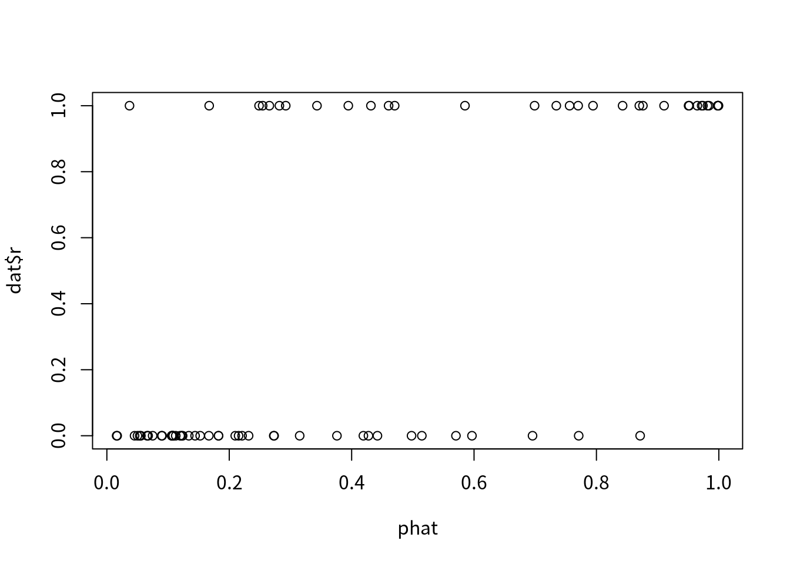

```r
plot(phat, jitter(dat$r))
```

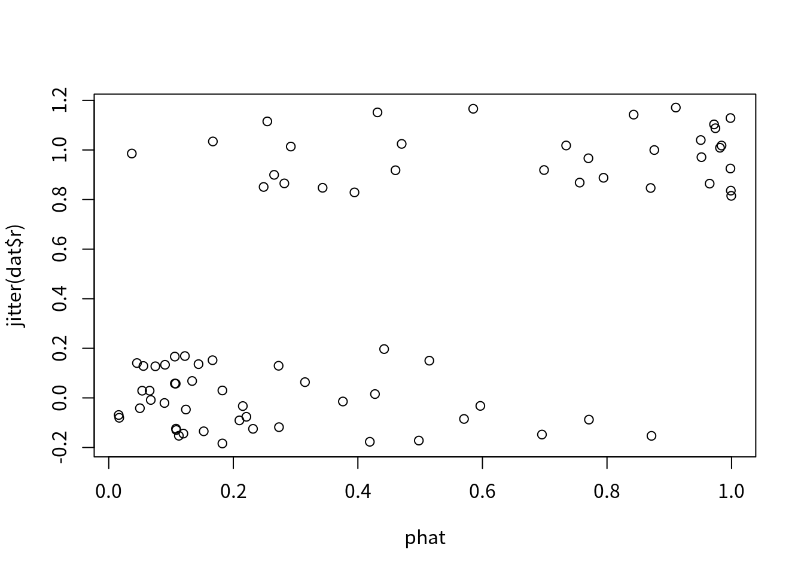

Suppose we choose a cutoff for theses predicted probabilities. If the model tells us the probabilities is higher than 0.5, we will classify the observation as a 1 and if it is less than 0.5, we will classify it as a 0.That way the model classifies each data point. Now we can tabulate these classifications against the truth to see how well the model predicts the original data.

```r
(tab0.5 = table(phat > 0.5, data_jags$y))
```

```
##        
##          0  1
##   FALSE 38 12
##   TRUE   6 21
```

```r
sum(diag(tab0.5)) / sum(tab0.5)
```

```
## [1] 0.7662338
```
The correct classification rate is about 76%, not too bad, but not great.

Now suppose that it is considered really bad to predict no calcium oxalate crystal when there in fact is one. We might then choose to lower our threshold for classifying data points as 1s. Say we change it to 0.3. That is, if the model says the probability is greater than 0.3, we will classify it as having a calcium oxalate crystal.

```r
(tab0.3 = table(phat > 0.3, data_jags$y))
```

```
##        
##          0  1
##   FALSE 32  7
##   TRUE  12 26
```

```r
sum(diag(tab0.3)) / sum(tab0.3)
```

```
## [1] 0.7532468
```
It looks like we gave up a little classification accuracy, but we did indeed increase our chances of detecting a true positive.

We could repeat this exercise for many thresholds between 0 and 1, and each time calculate our error rates. This is equivalent to calculating what is called the ROC (receiver-operating characteristic) curve, which is often used to evaluate classification techniques.
